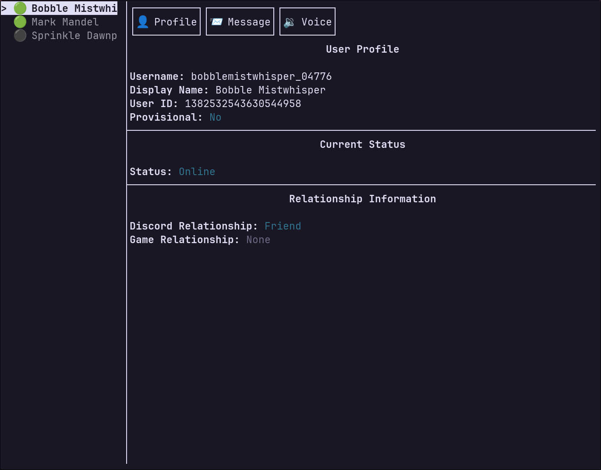

# Discord Social TUI

A terminal user interface for Discord's social features using the Discord Social SDK.



## Prerequisites

- C++23 compatible compiler
- CMake (3.10 or higher)
- Discord Social SDK (not included)

## Installation

### 1. Clone the repository

```bash
git clone https://github.com/markmandel/discord-social-tui.git
cd discord-social-tui
```

### 2. Install Discord Social SDK

You need to manually download and install the Discord Social SDK:

1. Download the Discord Social SDK from the [Discord Developer Portal](https://discord.com/developers/docs/discord-social-sdk/overview)
2. Extract the contents to `./lib/`
3. Ensure the header file is available at `./lib/discord_social_sdk/include/discordpp.h`

### 3. Build the project

```bash
cmake -B build && cmake --build build
```

## Running the Application

```bash
./build/discord_social_tui
```

### Required Environment Variables

The following environment variable needs to be set:

- `DISCORD_APPLICATION_ID` - Your Discord application ID

Example:
```bash
DISCORD_APPLICATION_ID=your_application_id ./build/discord_social_tui
```

## Development

### Formatting and Linting

```bash
cmake --build build --target lint
```

## License

This project is licensed under the Apache Licence 2.0 - see the LICENSE file for details.

Not an official Discord project.